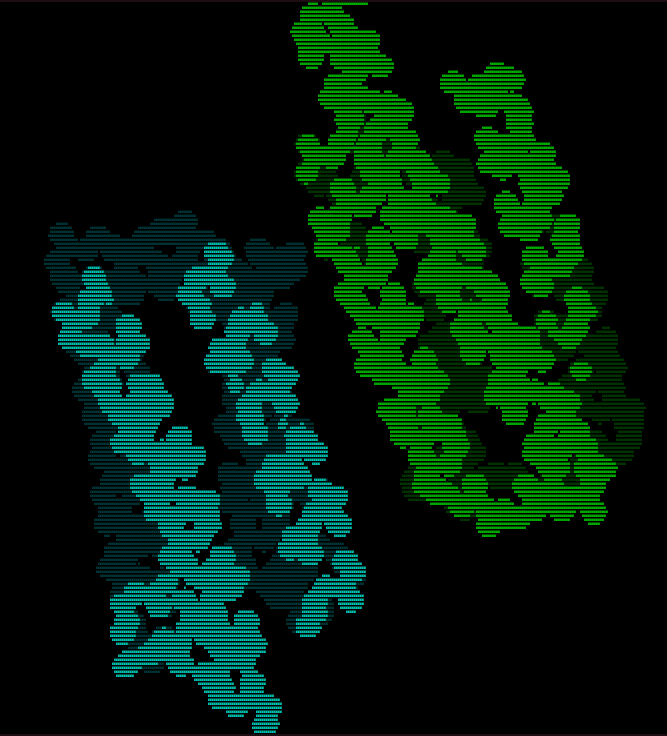
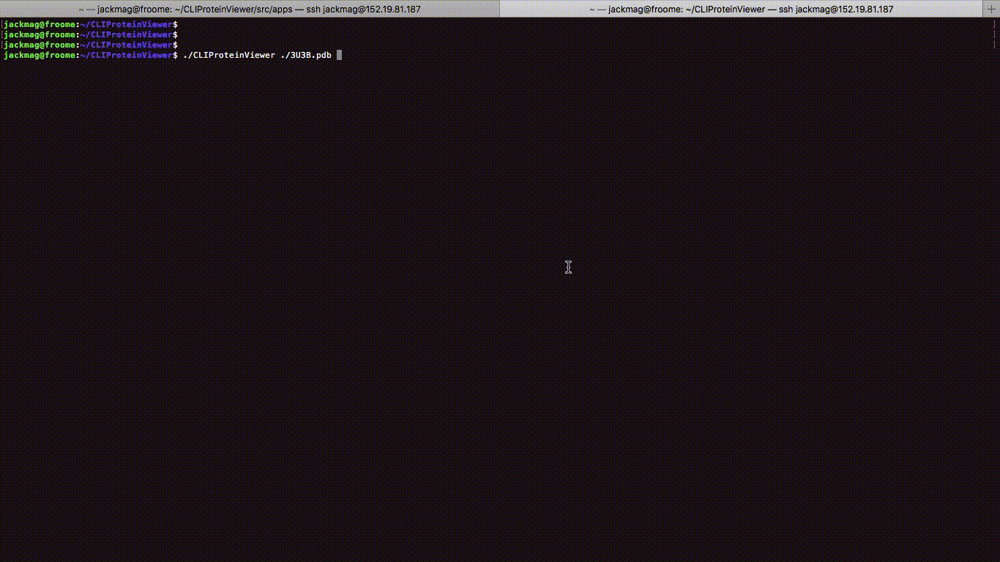

# CLIProteinViewer

CLIProteinViewer is an open-source and dependency-free tool to visually inspect your protein's structure using colored text in your console, as shown here:



This tool is useful for people who often run protein simulations on clusters and want to quickly visualize proteins without `scp`-ing them back to their local computer. Some example use cases are:

- _"Wait, which chain is the [insert name of interesting protein] again? Let me look"_

- _"Wow that simulation took a long time. Did my protein unfold? Let me look"_

- _"I want to dock these chains together but can't remember if they are already docked in this structure. Let me look"_

## Usage

### 1. Make your text size very small

This program uses each character as a single pixel.
The smaller your text is, the higher-resolution our image will be.

I often make my text so small that it can't be read.
In this case, I recommend typing out your run command _before_ making the text small,
but definitely make the text small before running your command (as shown in the gif below).

### 2. Start Program

Run `CLIProteinViewer my_protein.pdb`

This can be done with multiple pdb files at a time
but I recommend starting with just one first.

### 3. Move The Camera

The controls are listed below. In general, there are 3 things you can do:
- rotate the camera
- change the camera's properties
  - zoom in and out
  - change the distance where the shadows fall (hard to explain, best way is to just try it)
  - change the step size of the camera. `4` gives largest steps, `1` gives smallest. Large steps increase how much the camera moves when zooming and rotating.
- change the protein's representation


My first steps are usually:
- `4` to increase the step size of the camera
(increases the amount the camera moves when zooming or rotating)
- `w` once or twice to zoom in
- `left arrow` a few times to quickly rotate the protein and gain my bearings. 4 times will give you a full 360 degree rotation with the `4` step size
- `1` or `2` to decrease the step size of the camera for more local viewing

Depending on the protein, I also sometimes hit `e` (or `q`) at the beginning to adjust where the shadows fall.

There is a gif below that shows what this might look like for a dimer of 4-helix bundles

#### Controls

| Key | Outcome |
| - | - |
| Left/Right arrow keys | Rotate Z Axis (primary) |
| Up/Down arrow keys | Rotate X Axis |
| A/D | Rotate Y Axis |
| W/S | Zoom in/out |
| Q/E | Change shadow distance |
| 1 | Set rotation increment to pi/16 |
| 2 | Set rotation increment to pi/8 |
| 3 | Set rotation increment to pi/4 |
| 4 | Set rotation increment to pi/2 |
| 0 | Show all atoms |
| 9 | Show non-hydrogen atoms |
| 8 | Show non-hydrogen backbone atoms |
| 7 | Show backbone nitrogen atoms |

Note: All of these letters are lowercase


### 4. Exit

Nothing fancy here.
I did not program in a quit key so just hit `ctrl+c` when you are done.



_Shown above is a real time example of viewing the protein with pdb code 3U3B. Be patient, I opted to show the text-shrinking setup step so the cool stuff does not happen for a few seconds._

## Installation

Installation of any software can be intimidating.
If the steps below are too complicated, you can see my actual installation log at [this link](install_log.md)

#### 1. Clone this repository

```sh
git clone https://github.com/JackMaguire/CLIProteinViewer.git
```

#### 2. Compile

This step was designed to be as easy as possible,
so please contact me if you are running into troubles here.
There may be warnings that appear but those are fine.

```sh
cd CLIProteinViewer
bash just_install_everything_please.sh
```

#### 3. (optional) Configure

Sometimes visualization can get warped such that objects look too fat or skinny.
I did my best to fix this but it is not a generally solvable problem
because your computer's text size and font might be different than mine.
Luckily, there is a fix for this and it only needs to be done once (per user).

First, make your console's text size very small as described above.
Then, run `./set_CLIPV_params` and use the left and right arrow keys to modify the circle.
The right arrow key should make it wider, the left should make it thinner.
The goal is for the circle to be as round as possible (as opposed to an oval).

When you are done, hit `q` and your settings will be saved for that computer.

## Known Issues

- The console's colors do not always return back to normal upon completion.
  - Maybe it is time that I implement a "close" button that takes more care to reset the console.
